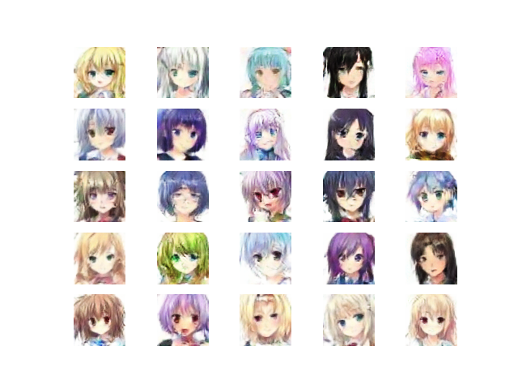

# Keras DRAGAN

Implementation of DRAGAN with keras.

Paper: [here](https://arxiv.org/abs/1705.07215)

Reference: [here](https://github.com/tjwei/GANotebooks/blob/master/dragan-keras.ipynb)

# Dataset
I got images from Twitter,Pinterest, and [Getchu](http://www.getchu.com/). Total is about 16000 images

# Demo
I build [website](https://vtuber-gan.herokuapp.com/index.html#/) with Tensorflow.js

<!--
# Example

You need ".npy" file in advance. Then,
```bash
$ python DRAGAN.py
``` -->

# Result



- Input size: 64x64
- Batch size: 128
- This is 800epochs( It takes 8 hours to get this result with GTX 1060)

## Environment
- OS: Windows 10
- CPU: Intel(R) Core(TM)i7-8700
- GPU: NVIDIA GTX1060 6GB
- RAM: 8GB
