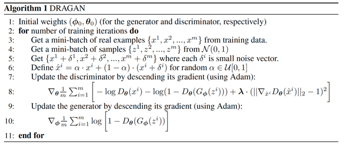
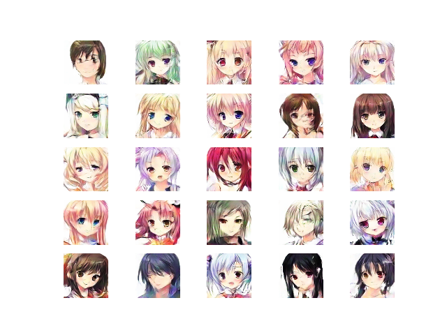
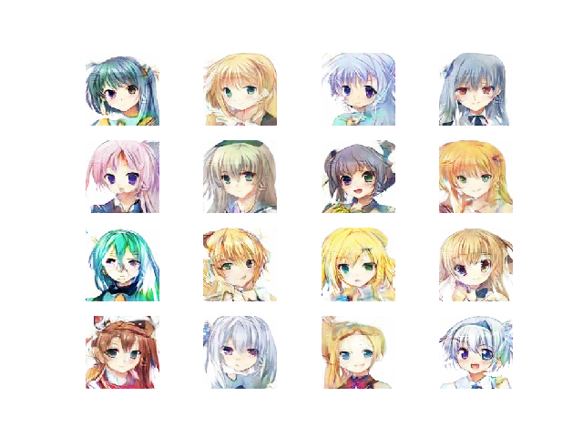
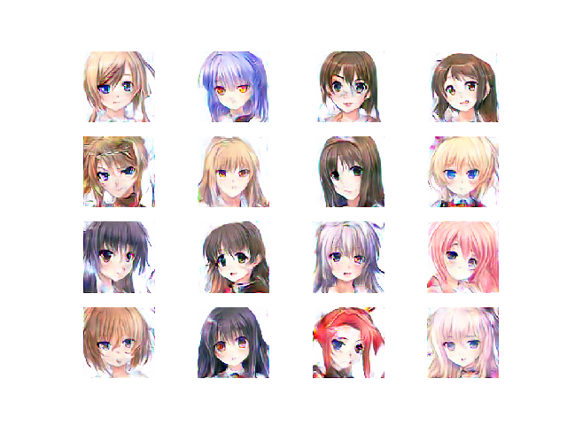
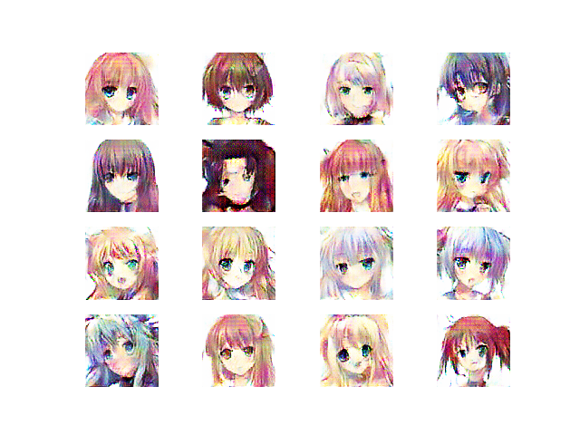

# Keras DRAGAN

Implementation of DRAGAN(Deep Regret Analytic Generative Adversarial Networks) with keras.

Paper: [here](https://arxiv.org/abs/1705.07215)

Reference: [here](https://github.com/tjwei/GANotebooks/blob/master/dragan-keras.ipynb)

# Dataset
I got images from Twitter,Pinterest, and [Getchu](http://www.getchu.com/). Total is about 16000 images

# Demo
I build [website](https://girls-gan.herokuapp.com/index.html#/) with Tensorflow.js (recommend chorme)

# Result 

### DRAGAN 

imagesize: 64x64
batchsize: 128

 

### DRAGAN + Residual
 
imagesize: 64x64
batchsize: 128

 
 
### DRAGAN + RDN

imagesize: 128x128
batchsize: 32

### DRAGAN + EDSR

imagesize: 128x128
batchsize: 32

### latent

## Environment
- OS: Windows 10
- CPU: Intel(R) Core(TM)i7-8700
- GPU: NVIDIA GTX1060 6GB
- RAM: 16GB
